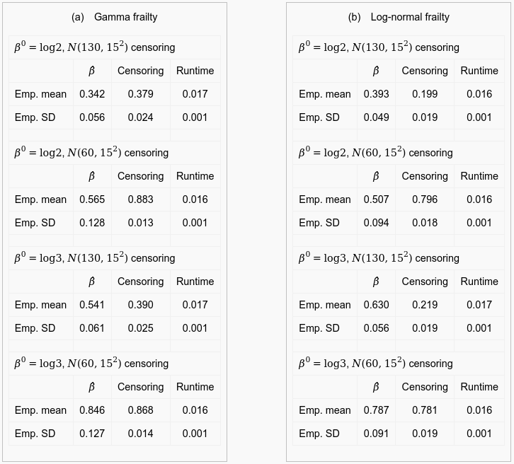
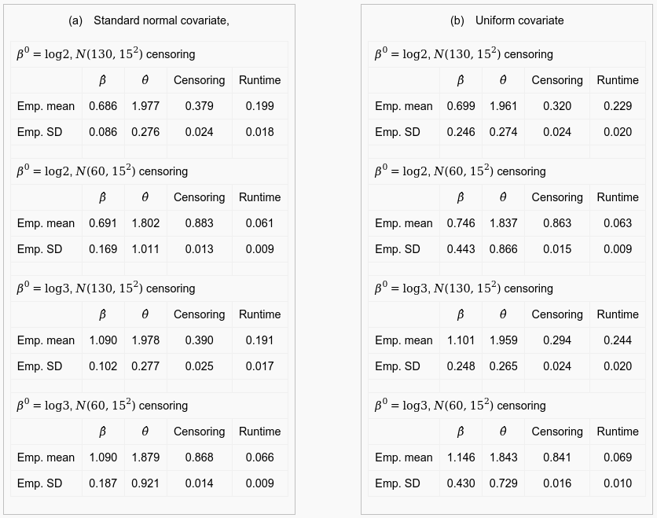
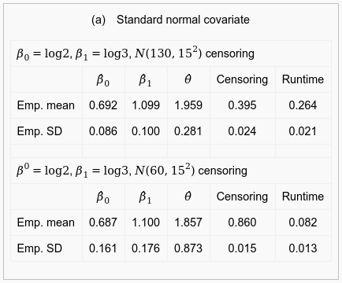
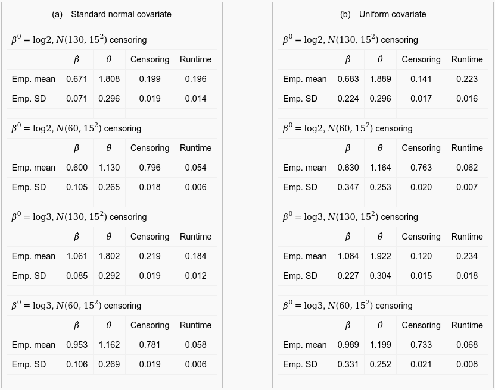
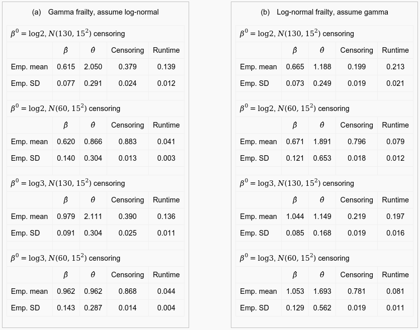

# GSoC 2015 proposal: Multivariate Survival analysis
Test results and proposal for GSoC 2015

See the [proposal](proposal/Monaco-gsoc2015.pdf?raw=true). The completed test is reproduced below.

## Simulation results (Appendix B in proposal)

Simulations were performed with R version 3.1.3 running in an Ubuntu 12.04 desktop with AMD Phenom 9550 Quad-Core 2.20 GHz Processor. All of the simulation results are obtained using penalized partial likelihood estimation, namely the coxph function in the survival package with the Breslow method. Each simulation was repeated 500 times to obtain the empirical mean and SD. The empirical censorship and runtime (in seconds) are also reported. For more information, see the [proposal](proposal/Monaco-gsoc2015.pdf?raw=true).

**Table 4** Ignoring the clustered data: A constant frailty is assumed when the actual frailty is either gamma or log-normal. The coefficients are consistently biased, as this model ignores the clustered data and underestimates the effect of the coefficient. The bias is less severe with greater censorship, likely the result of decreased clustering. There is more diversity at 80% censorship due to fewer observed failure times.

**Table 5** Gamma frailty with a single covariate: The model behaves as anticipated, and correctly estimates the coefficient and frailty distribution variance, within error. Note that the simulation in [#gorfine2006prospective] may have used {\bf Z}\sim\mathcal{U}(0,1) and not {\bf Z}\sim N(0,1), as confirmed by one author.

**Table 6** Gamma frailty with two covariates: Again, the coefficients and frailty variance are correctly estimated within error.

**Table 7** Log-normal frailty with a single covariate: With \theta=2
 , the log-normal has a heavier tail than the gamma, and thus more clustering. As a result, with high censorship, the coefficients are slightly underestimated and the frailty variance estimation is biased. The bias is reduced by increasing the sample size. With 3000 families and 20 members in each family, the mean estimation of \theta is \sim1.65 with N(60,15^{2}) censoring. Similar to the gamma frailty, the error for uniformly-distributed individual covariates is higher than standard normal individual covariates. 

**Table 8** Assuming the wrong frailty: When the true frailty is log-normal and we assume a gamma distribution (b), the regression coefficient is slightly biased and the estimator of \theta is clearly biased, especially with low censoring rate. This is a result of underestimating how much the data are clustered, since the log-normal has a heavier tail and produces more clustered data. Underestimation is not as severe when the true frailty is gamma and a log-normal is assumed (a). In this case, we assume the data is more clustered than it actually is. The underestimation of the regression coefficients in (a) is more severe than (b).

